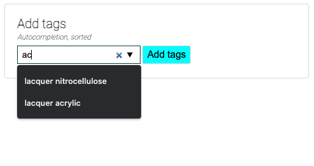

# Typeahead monorepo w frequency occurrence sort autocomplete for React

- [Demo / Screenshots](#demo-screenshots)
- [Runbook](#runbook)

> A typeahead React component to add tags to a server/database/collection.

- Autocomplete dropdown list sorted by frequency occurrences of tags
- "Add a new tag" to items to search for them later

- Note: The data transformations could happen on the front end (wrt sorting 
et al) in [`server.js`](./src/server.js). Maybe could be in Sagas or helpers.

## Demo screenshots

> Searching - either add a new tag, or use search function by typing

> Autocomplete tags sorted by frequency occurrence and returned to user

- User can enter any term they like to add as a tag

> Confirmation message upon tag receipt

- focus styles
- transitions, animations

## Runbook

- git clone
- `npm install`
- `npm start`
- `npm test` // UI and API testing w Supertest
